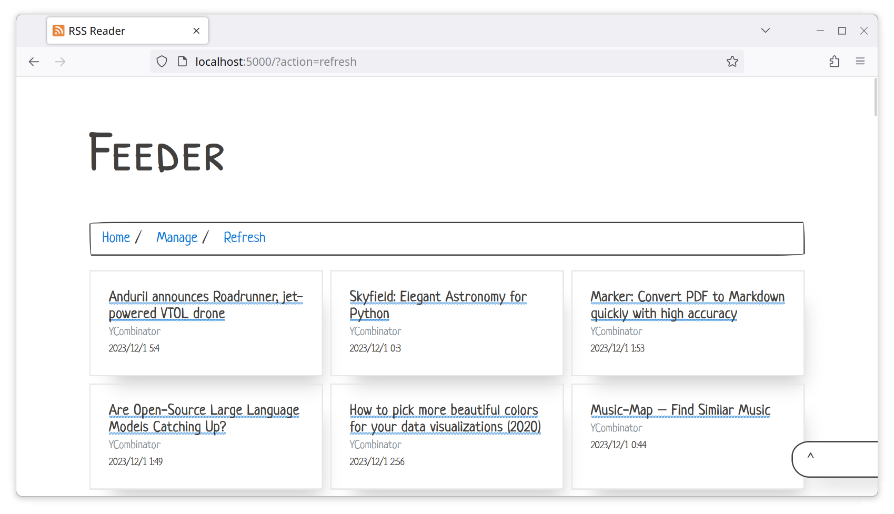

# RSS Reader

Simple RSS Feed Reader



## Insallation/Usage

```
python -m venv env && \
source ./env/bin/activate && \
pip install -r requirements.txt && \
python app.py
```

Head over to `localhost:5000` to view the RSS Reader.

## Misc.

A simple service file.

```
[Unit]
Description="Local RSS Reader"

[Service]
WorkingDirectory=<project-folder-location>
ExecStart=/bin/bash -c 'cd <project-folder-location> && source ./env/bin/activate && python app.py'
```
